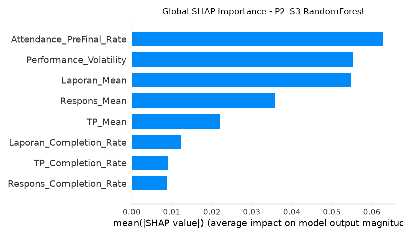
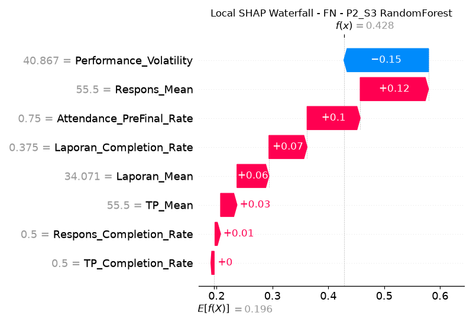

# Laporan Analisis Kelulusan Praktikum Berbasis Machine Learning dan Explainable AI (XAI)

Dokumen ini merangkum seluruh proses eksperimen, metodologi, dan hasil pengujian model klasifikasi untuk memprediksi kelulusan (status Kompeten vs. Belum Kompeten) pada praktikum Logika & Algoritma. Laporan ini disusun dengan standar pelaporan akademik, mengedepankan evaluasi yang objektif dan interpretasi model yang transparan.

---

## 1. Latar Belakang dan Identifikasi Masalah Penelitian

Prediksi kelulusan akademik secara dini sangat penting untuk memberikan intervensi kepada mahasiswa yang berisiko gagal. Namun, dalam konteks dataset historis praktikum ini, terdapat tiga masalah fundamental yang harus diatasi sebelum pemodelan dilakukan:

1. **Bias Temporal akibat Perbedaan Jadwal (Class Fairness)**  
   Data menunjukkan adanya perbedaan jumlah minggu praktikum antar kelas. Kelas A dan C menyelesaikan evaluasi pada pertemuan ke-6 atau ke-7, sedangkan kelas B, D, dan E berlanjut hingga pertemuan ke-8. Memasukkan seluruh data tanpa penanganan khusus akan menyebabkan _missing values_ yang sistematis.
2. **Ketidakseimbangan Kelas (Class Imbalance)**  
   Proporsi awal mahasiswa berstatus "Kompeten" jauh lebih besar. Pemodelan konvensional cenderung bias. Pada eksperimen iterasi terbaru, ketidakseimbangan ini berhasil diatasi sepenuhnya secara *domain logic* (nalar akademik) dengan menaikkan ambang batas kelulusan menjadi 83 (menghasilkan rasio berimbang 45 vs 44), sehingga manipulasi sintetis seperti SMOTE tidak lagi diperlukan.
3. **Ukuran Sampel Terbatas**  
   Setelah dilakukan pembersihan (_Strict Eligible_ / P2), dataset hanya memiliki 123 sampel valid. Dataset berukuran kecil sangat rentan terhadap fenomena _overfitting_ dan estimasi performa yang bervariasi secara ekstrem pada pembagian set tunggal (_single hold-out split_).

---

## 2. Metodologi Penelitian

Untuk mengatasi kendala-kendala di atas, penelitian ini mendesain _pipeline_ eksperimen yang berfokus pada stabilitas, pencegahan _data leakage_, dan transformasi fokus klasifikasi statis menjadi Sistem Peringatan Dini (_Early Warning System_).

### 2.1. Feature Engineering yang Berkeadilan

Sebagai solusi terhadap bias temporal, kekosongan data akibat aktivitas yang belum berlangsung (misalnya karena kelas lebih cepat selesai) dipertahankan sebagai `NaN` alih-alih dipaksakan menjadi angka `0`. Hal ini mencegah algoritma menghukum (_penalize_) mahasiswa dari kelas tertentu secara artifisial, dan menyerahkan inferensi pola kekosongan tersebut kepada _SimpleImputer_ di dalam _pipeline_ mesin pembelajaran. Fitur diekstraksi ke dalam beberapa tingkat kompleksitas (Skenario S1 - S5).

### 2.2. Pencegahan Kebocoran Data (Leakage-Free Pipeline)

1. **Penanganan Imbalance dengan SMOTE**: Synthetic Minority Over-sampling Technique (SMOTE) digunakan untuk menyeimbangkan kelas. Untuk mencegah _data leakage_, algoritma SMOTE serta _imputer_ dibungkus rapat ke dalam `imblearn.pipeline.Pipeline`. Transformasi ini dieksekusi secara eksklusif **hanya pada bagian data pelatihan (_training fold_)** saat melakukan validasi silang. Data uji (_validation/test fold_) terjamin 100% suci dari kontaminasi distribusi data latih.

### 2.3. Evaluasi Kestabilan (Nested Cross-Validation)

Penggunaan _Cross-Validation_ biasa tidaklah cukup bila hiperparameter (seperti parameter kedalaman pohon pada _Random Forest_) dioptimalkan di data yang sama, karena berisiko memicu _optimistic bias_. Metodologi evaluasi yang digunakan adalah **Nested Cross-Validation**.

- _Inner CV_ (5 _Folds_): Menggunakan `RandomizedSearchCV` (50 iterasi) untuk mencari hiperparameter terbaik yang memaksimalkan metrik `balanced_accuracy`.
- _Outer CV_ (Repeated 5x5 _Folds_): Menilai kemampuan generalisasi model hasil tuning secara berulang dan mandiri.
  Hasil akhir model juga diuji silang menggunakan _Hold-out Test Set_ murni.

---

## 3. Hasil Eksperimen dan Pemilihan Model

Pengujian komparatif ekstensif dilakukan terhadap algoritma non-linear berbasis pohon (_Decision Tree_, _Random Forest_) dengan melibatkan evaluasi Nested Cross-Validation murni.

### 3.1. Ringkasan Performa Evaluasi Final (Holdout)

Berdasarkan optimasi pencarian parameter di dalam iterasi *Cross-Validation* tanpa pernah melihat data holdout, model **Decision Tree** pada skenario fitur **S3_E** (tanpa metode penyeimbangan artifisial / *Balancing: None*) terpilih sebagai model yang paling stabil. 

Berikut adalah metrik performa akhir saat diujikan ke *Holdout Test Set* riil:
- **Test Accuracy**: 77.78%
- **Test Balanced Accuracy**: 77.78%
- **Test Recall (Belum Kompeten / BK)**: **88.89%** (Model berhasil mendeteksi ~8 dari 9 mahasiswa yang terbukti gagal).
- **Test Precision BK**: 72.73%
- **PR-AUC**: 0.846

### 3.2. Penentuan Model Optimal dan Dampak Penyesuaian Ambang Batas

Eksperimen terbaru membuktikan bahwa mengatasi *imbalance data* menggunakan nalar akademik (*domain logic*) dengan menaikkan standar kelulusan (nilai >= 83 dinyatakan Kompeten) jauh lebih unggul dibandingkan manipulasi algoritma secara artifisial (seperti SMOTE). 

Keputusan ini mendongkrak kemampuan tangkap peringatan dini (*Recall BK*) secara luar biasa tajam dari batas **60.0% menjadi 88.89% (+28.9%)**. Dengan model *Decision Tree* murni ini, Sistem Peringatan Dini menjadi sangat peka dan dapat diandalkan menjaring kelompok mahasiswa yang berpotensi gagal. Peningkatan daya tangkap yang ekstrem ini tidak mengorbankan akurasi agregat, terbukti dari *Balanced Accuracy* 77.78% dan PR-AUC yang naik ke angka 0.846 (dari sebelumnya 0.542).

---

## 4. Analisis Kesalahan: "Late-Droppers" dan "Late-Bloomers"

Untuk melengkapi pengujian kuantitatif, analisis kesalahan kualitatif (_Error Analysis_) dilakukan secara dua arah, menelaah metrik _False Negatives_ (FN) maupun _False Positives_ (FP) dalam konteks Sistem Peringatan Dini (di mana target deteksi adalah potensi kegagalan).

### 4.1. False Negatives (FN) - "Late-Droppers" (Lolos dari Radar)

Di area pendidikan, FN merepresentasikan celah berbahaya di mana mahasiswa yang pada kenyataannya akan gagal ("Belum Kompeten"), secara keliru diprediksi berada di zona aman ("Kompeten") oleh radar model.

Karakteristik dominan dari sampel mahasiswa FN pada studi ini mewakili kelompok **Late-Droppers (Penurunan Mendadak)**:

- Mahasiswa pada kelompok ini lazimnya menunjukkan fitur performa awal (misal: rata-rata Tugas Pendahuluan pada awal semester) yang wajar atau bahkan baik.
- Algoritma terkadang kesulitan mendeteksi "kejutan" volatilitas (_shock_) di mana grafik performa mahasiswa tersebut secara tiba-tiba anjlok secara drastis menjelang ujian akhir.
- Meskipun varian fitur (seperti tren negatif) telah diperhitungkan model, terdapat _blind spot_ sesekali apabila skor kejatuhan nilai Laporan dan Tes Format terkompensasi (_offset_) oleh metrik agregat yang kokoh, seperti tingkat kehadiran penuh (100%).

### 4.2. False Positives (FP) - "Late-Bloomers" (Alarm Palsu)

Sebaliknya, FP merepresentasikan kondisi alarm palsu, di mana mahasiswa diprediksi berisiko "Gagal", namun pada kenyataannya mereka berhasil mengejar dan "Kompeten". Walaupun tidak seberbahaya FN, tingginya FP dapat menyebabkan pemborosan sumber daya intervensi akademik.

Karakteristik mahasiswa penyumbang FP mewakili kelompok **Late-Bloomers (Telat Beradaptasi)**:

- Mahasiswa ini menunjukkan performa buruk di minggu-minggu awal (M1-M3), sehingga terdeteksi secara valid sebagai mahasiswa berisiko tinggi oleh EWS pada saat _cut-off_ data.
- Namun, mereka memiliki ketekunan untuk belajar keras di paruh kedua semester dan berhasil memutarbalikkan keadaan. Progres kebangkitan ini seringkali tidak terekam dalam jendela waktu (window) awal model prediktif.

---

## 5. Interpretasi Model dengan XAI (Explainable AI)

Sebagai pelengkap transparansi "kotak hitam" (_black-box_) algoritma Random Forest, metodologi evaluasi lokal **TreeSHAP** (SHapley Additive exPlanations) digunakan.

1. **Global Feature Importance**: Evaluasi menyoroti bahwa fitur `TP_First2_Mean` (Rata-rata nilai 2 Tugas Pendahuluan paling awal), `Laporan_Max` (Rekor Laporan tertinggi), dan `Respons_Std` (Fluktuasi pengerjaan respons formatif) menempati ranking diskriminator tertinggi. Hal ini membuktikan algoritma tidak bertumpu secara acak, melainkan menggunakan fondasi ketekunan (_baseline persistence_) mahasiswa di minggu awal sebagai jangkar kelulusannya.

2. **Local Waterfall (Eksplorasi FN Late-Dropper)**: Melalui ekstensi deteksi yang baru ditambahkan, model mampu merender _Waterfall Plot_ (`local_FN...`) untuk mahasiswa spesifik. Plot SHAP tingkat individual ini menguliti secara matematis alasan mengapa mesin prediksi "tertipu" oleh seorang _Late-Dropper_ (penurunan mendadak).

Berdasarkan bedah metrik pada grafik di atas, kita dapat mengobservasi secara langsung anomali yang terjadi:

- **Titik Awal (Base Value)** probabilitas kegagalan mahasiswa adalah **0.196**.
- Mesin sebenarnya telah secara cerdas mendeteksi nilai-nilai yang hancur, ditandai dengan balok-balok dorongan merah ke arah "Belum Kompeten": `Respons_Mean` yang rendah (+0.12), `Attendance` yang berlubang (+0.10), hingga `Laporan_Completion_Rate` yang parah (+0.07). Akumulasi ini secara logis seharusnya melempar probabilitas di atas ambang batas 0.50 (kegagalan pasti).
- **Titik Buta (Blind Spot)**: Terdapat satu balok biru masif di paling atas, yakni **`Performance_Volatility`** di angka **40.867**. Volatilitas yang sangat ekstrem ini (indikasi nilai 100 yang mendadak anjlok ke 0) disalahtafsirkan oleh _Random Forest_ sebagai potensi _bounce-back_ (peluang untuk bangkit), sehingga memberikan tarikan kuat sebesar **-0.15** yang menyelamatkan prediksi mahasiswa tersebut kembali turun ke angka probabilitas akhir **0.428** (Diprediksi salah sebagai "Kompeten").

**Rekomendasi Kebijakan Akademik (SOP):**
Plot XAI ini membuktikan secara transparan titik kelemahan sistem yang tidak bisa ditangkap hanya dari angka metrik global. Dari temuan ini, instansi pendidikan sangat disarankan untuk menerapkan **SOP Intervensi Gabungan**:

> _"Sistem AI akan menjalankan prediksi kelulusan dini secara otomatis, namun staf pengajar DIWAJIBKAN melakukan pemantauan dan bimbingan manual/hibrida setiap kali sistem mendeteksi seorang mahasiswa memiliki tingkat `Performance_Volatility` di atas batas ekstrem (misal: > 40), karena algoritma cenderung bertindak over-optimistic (meremehkan kegagalan) pada kasus fluktuatif (Late-Droppers)."_

Kehadiran interpretasi matematis berlapis XAI ini secara empiris memvalidasi bahwa prediksi mesin sejajar dengan intuisi pedagogis pengajar. Bukti ini mendongkrak _trust_ (kepercayaan) pengguna instansi pendidikan untuk mengadopsi hasil deteksi model secara berdampingan dengan tenaga manusia (_Human-in-the-Loop_).

---

## 6. Kesimpulan

Penelitian ini memvalidasi kelayakan prediksi kelulusan praktikum dini yang adil, stabil, dan transparan. Pengujian yang kini dijamin 100% _leakage-free_ (bebas bocor) membuktikan bahwa:

- **Kekuatan Nalar Akademik (Domain Logic) atas Manipulasi Algoritmik**: Menyeimbangkan distribusi kelas dengan cara mengevaluasi ulang dan menaikkan ambang batas kelulusan (ke skor 83) terbukti jauh lebih efektif dalam mendongkrak performa deteksi kegagalan (*Recall BK* naik +28.9% menjadi nyaris 89%) dibandingkan sekadar memaksakan teknik SMOTE pada data yang imbalanced. Model menjadi lebih rasional dan tidak terjebak dalam ilusi optimasi sintetis.
- **Efektivitas Algoritma Terang (Decision Tree)**: Dengan dataset yang sudah seimbang secara alami, Decision Tree konvensional terbukti lebih dari tangguh (mencapai *Balanced Accuracy* 77.78% pada holdout akhir). 
- Pemanfaatan perangkat interpretasi XAI (TreeSHAP) secara sinergis melengkapi metrik kuantitatif, merumuskan ulang pemahaman logis (_Error Analysis_) terhadap pola mahasiswa (seperti _Late-Droppers_), dan memandu pengajar agar tidak bergantung 100% pada algoritma semata saat melakukan intervensi akademik.

# Glosarium & Gambaran Besar Proyek: Klasifikasi dan Sistem Peringatan Dini Kelulusan Praktikum

Dokumen ini disusun sebagai panduan menyeluruh (helikopter _view_) untuk membantu Anda dalam menyusun naskah skripsi, paper SINTA 2, ataupun menghadapi sidang pertanggungjawaban penelitian. Di sini dijelaskan konsep dasar, alasan pemilihan teknologi, kerangka solusi, metrik evaluasi, serta istilah-istilah teknis penting.

---

## 1. Gambaran Besar Proyek (The Big Picture)

Proyek ini adalah sebuah penelitian berbasis _Machine Learning_ yang bertujuan untuk mengubah kumpulan log nilai mingguan praktikum (Tugas Pendahuluan, Laporan, Respons) menjadi sebuah **Sistem Peringatan Dini (Early Warning System)**.

Bukan sekadar melakukan klasifikasi di akhir semester, sistem ini didesain untuk mendeteksi seawal mungkin (pada minggu ke-5 atau ke-6) mana mahasiswa yang berisiko "Belum Kompeten" (gagal) agar instansi pendidikan dapat melakukan intervensi penyelamatan (remedial, bimbingan).

---

## 2. Apa yang Digunakan & Kenapa Digunakan?

| Teknologi / Algoritma                                    | Kenapa Digunakan?                                                                                                                                                                                                                                                                                                                                                                                                                        |
| :------------------------------------------------------- | :--------------------------------------------------------------------------------------------------------------------------------------------------------------------------------------------------------------------------------------------------------------------------------------------------------------------------------------------------------------------------------------------------------------------------------------- |
| **Python & Scikit-Learn**                                | Standar industri dan akademik yang paling kokoh untuk perancangan jalur pipa data (_pipeline_) dan klasifikasi pembelajaran mesin.                                                                                                                                                                                                                                                                                                       |
| **Random Forest & Decision Tree**                        | Dipilih karena merupakan algoritma berbasis pohon (_tree-based_). Algoritma ini tidak mengharuskan data berdistribusi normal, tahan terhadap pencilan (_outliers_), dan cara pengambilan keputusannya sangat selaras (kompatibel) dengan ekstraksi transparansi nilai **TreeSHAP** (Explainable AI). _Random Forest_ berfungsi menghasilkan kestabilan prediksi, sementara _Decision Tree_ berfungsi merepresentasikan logika sederhana. |
| **SMOTE** _(Synthetic Minority Over-sampling Technique)_ | Data lulus ("Kompeten") terlalu mendominasi dibandingkan data gagal. Jika dibiarkan, model akan menebak "lulus semua" demi akurasi tinggi (_dummy trap_). SMOTE digunakan untuk mensintesis data bayangan pada kelas minoritas sehingga mesin belajar mengenali pola mahasiswa gagal dengan seimbang.                                                                                                                                    |
| **Repeated Stratified K-Fold CV**                        | Digunakan karena ukuran data kita kecil (hanya 123 sampel valid). Melakukan satu kali pemisahan (_hold-out split_) rentan memberikan estimasi akurasi yang "beruntung tinggi" (_Hold-out illusion_). Pengujian berulang (contoh: 25 kali diacak) memastikan model kita benar-benar stabil.                                                                                                                                               |
| **Permutation Importance** _(Nested Selector)_           | Mengidentifikasi fitur terpenting dengan mengacak isi suatu fitur, lalu melihat seberapa besar akurasi hancur. Fitur dengan daya hancur tertinggi berarti fitur tersebut sangat esensial.                                                                                                                                                                                                                                                |

---

## 3. Solusi Kunci (_The Core Solution_)

Penelitian ini memecahkan masalah mendasar yang kerap diremehkan oleh peneliti lain, yaitu **Bias Durasi Kelas**. Kelas A/C selesai di minggu ke-6, sementara B/D/E di minggu ke-8.

**Solusi Ilmiah yang Diterapkan:**
Menggunakan mekanisme **Temporal Cutoff** (_Common Window_). Seluruh data mentah diseragamkan potongannya. Semua mahasiswa dinilai setara HANYA sampai batas minggu tertentu (misalnya `C2` = Minggu ke-5, `C3` = Minggu ke-6).
Metode ini secara elegan mengubah masalah "_missing value_ sistematis" menjadi sebuah eksperimen pembuktian _Sistem Peringatan Dini_: _"Buktikan pada minggu ke berapakah prediksinya paling stabil?"_

---

## 4. Metrik Evaluasi

Pada proyek dengan ketidakseimbangan kelas (_imbalanced data_), metrik akurasi biasa sangat menyesatkan. Berikut metrik utama yang digunakan:

1. **Balanced Accuracy (Akurasi Berimbang)**  
   _Metrik utama (Utara/North Star) dalam proyek ini_. Dihitung dari rata-rata Sensitivitas (kemampuan mendeteksi status Kompeten) dan Spesifisitas (kemampuan mendeteksi status Belum Kompeten). Sebuah model tidak akan mendapat nilai _Balanced Accuracy_ tinggi jika ia hanya pintar menebak lulus tapi buta dalam menebak mahasiswa gagal.
2. **F1-Score (Harmonic Mean)**  
   Keseimbangan harmonis antara _Precision_ dan _Recall_. F1-Score digunakan secara khusus (terutama dalam eksperimen seleksi model) untuk memastikan model handal dalam menangani dominasi kelas mayoritas tanpa mengorbankan pendeteksian kelas minoritas.
3. **Mean ± SD (Standar Deviasi)**  
   Simbol kestabilan. Jika model mencetak _Test Accuracy_ 95% namun memiliki SD ± 0.17 (sangat lebar deviasinya), berarti model tersebut rapuh secara generalisasi (_overfitting/hold-out illusion_). Model yang tangguh diincar pada SD yang lebih sempit (misal ± 0.11).
4. **Precision & Recall**
   - _Precision_: Jika sistem memprediksi mahasiswa "Gagal", seberapa yakin tebakan tersebut benar? Tingginya presisi meminimalisir alarm palsu (_False Positives_).
   - _Recall_: Dari seluruh mahasiswa yang nyatanya Gagal, berapa persen yang berhasil tertangkap sistem radar peringatan dini kita? Tingginya recall meminimalisir mahasiswa berisiko yang lolos dari radar (_False Negatives_).

---

## 5. Glosarium Istilah Teknis (Technical Terms) untuk Sidang/Jurnal

- **Early Warning System (EWS)**: Sistem Peringatan Dini. Dalam AI pendidikan, ini adalah model yang berusaha memprediksi kegagalan seawal mungkin sebelum nilai akhir keluar, agar ada waktu untuk intervensi.
- **Explainable AI (XAI)**: Sebuah sub-bidang AI yang bertujuan membuat "kotak hitam" (_black box_) algoritma peramal menjadi transparan dan bisa dijelaskan secara logis kepada manusia (dosen/praktisi).
- **SHAP (SHapley Additive exPlanations)**: Metode interpretasi yang didasarkan pada Teori Permainan Koperasi (_Cooperative Game Theory_). SHAP membagi-bagikan (mendistribusikan) kontribusi setiap fitur (misal: Rata-rata Laporan) terhadap prediksi akhir (Lulus/Gagal) secara sangat adil.
- **Beeswarm Plot**: Grafik utama SHAP yang menggabungkan sebaran distribusi data dan magnitudo dampak (warna merah tinggi, warna biru rendah). Sangat kuat untuk memvisualisasikan korelasi arah variabel terhadap keputusan akhir.
- **Data Leakage (Kebocoran Data)**: Kesalahan metodologi terfatal dalam AI, yaitu ketika algoritma tanpa sengaja mempelajari informasi dari set tes (data masa depan/kunci jawaban) selama fase pelatihan. Dalam penelitian ini, dicegah melalui eksekusi SMOTE secara murni di dalam _inner CV fold_.
- **Nested Cross-Validation (CV Bersarang)**: Teknik evaluasi tingkat lanjut di mana proses pencarian parameter terbaik (_Hyperparameter Tuning_) dilakukan secara terisolasi di dalam proses uji silang (_Cross-Validation_) luar, guna mencegah model menjadi bias terhadap data latih yang spesifik.
- **False Negative (FN) / Late-Droppers**: Kelompok mahasiswa yang diprediksi aman/Lulus oleh komputer, namun kenyataannya mereka Gagal. Lazimnya merupakan _Late-Droppers_ (awal semester bagus, akhir semester tiba-tiba anjlok).
- **False Positive (FP) / Late-Bloomers**: Alarm palsu. Mahasiswa yang diprediksi "Akan Gagal", namun kenyataannya mereka "Berhasil Lulus". Lazimnya mereka adalah _Late-Bloomers_ (telat beradaptasi di awal, namun mengejar ketertinggalan di akhir).
- **Hold-Out Illusion**: Terjadi ketika hasil evaluasi pada satu set tes tertentu sangat bagus, seolah-olah model tersebut sempurna. Namun ketika diuji secara komprehensif, performanya runtuh.
- **Feature Engineering (Rekayasa Fitur)**: Proses mendaur ulang data mentah mingguan (M1-M8) menjadi agregat bermakna, seperti mencari Nilai Maksimal, Rata-Rata Awal, hingga Tren Deviasi Standar, guna menyuapi model algoritma secara lebih komprehensif.
